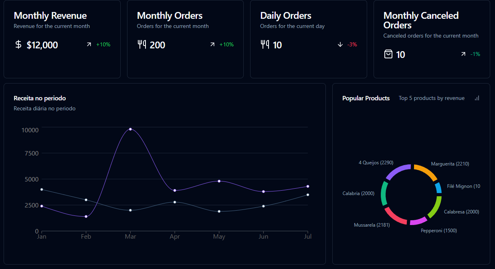

# Pizzashop-web

Dashboard for establishment management and order control. In ifood style.

## Preview

## Tools

* Ferramentas
* React
* React Router DOM
* Tailwind
* shadcn/ui
* React Query
* Radix

## Key learnings
* JWT authentication
* Caching and revalidation
* Connection to back-end (API)
* Unit tests

## Functionalities
* Establishment registration;
* Shop login (magic link);
* Customer registration;
* Creating new orders;
* Menu management;
* Review management;
* Order management;
* Managing the establishment's profile;
* Store open/closed;
* Metrics for dashboard;
* Graph of orders in the last 15 days;
* Graph of values over the last 15 days;
* Average reviews (month/general);
* Average orders per day (month/general);
* Sound notifications of new orders (change favicon);

